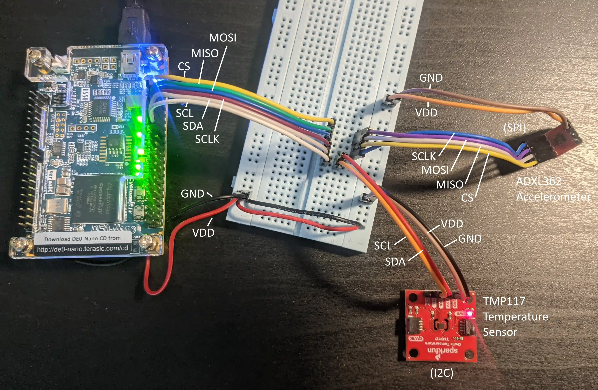
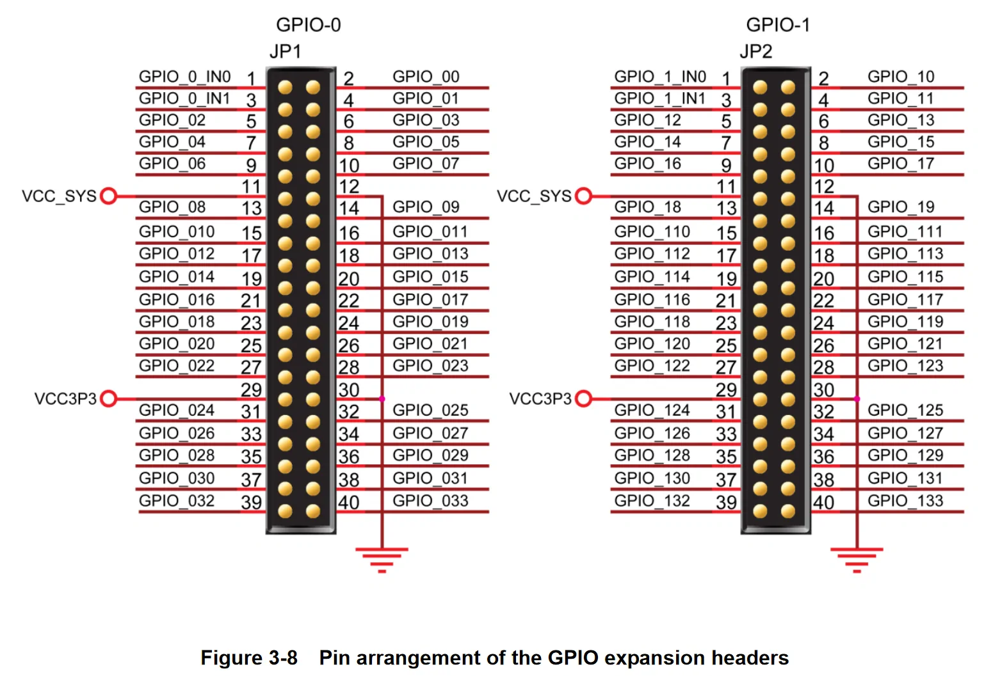

# HPLP-UHF-RFID-SKY130
- XSchem circuit schematics for power-harvesting and demodulation for WISP-like ASIC in Skywater-130nm process
- Verilog for data processing and interacting with sensors

# Device and Pinout
- Tested on DE0-Nano
    - Cyclone IV E - EP4CE22F17C6

#### GPIO Configuration
|Use|Signal Name|Expansion Header|Pin|
--- | --- | --- | ---
|SPI MOSI|GPIO_01|GPIO-0|4|
|SPI MISO|GPIO_03|GPIO-0|4|
|SPI CS0|GPIO_05|GPIO-0|4|
|SPI CS1|GPIO_013|GPIO-0|4|
|SPI SCLK|GPIO_07|GPIO-0|4|
|I2C SDA|GPIO_09|GPIO-0|4|
|I2C SCL|GPIO_011|GPIO-0|4|

#### FPGA Specific Pinout Configuration
|Node Name|Direction|Location|I/O Standard|
--- | --- | --- | ---
|CLOCK_50|Input|PIN_R8|2.5 (Default)
|GPIO_01|Output|PIN_C3|2.5 (Default)
|GPIO_03|Input|PIN_A3|2.5 (Default)
|GPIO_05|Output|PIN_B4|2.5 (Default)
|GPIO_07|Output|PIN_B5|2.5 (Default)
|GPIO_09|Bidir|PIN_D5|2.5 (Default)
|GPIO_011|Output|PIN_A6|2.5 (Default)
|GPIO_013|Output|PIN_D6|2.5 (Default)
|KEY[1]|Input|PIN_E1|2.5 (Default)
|KEY[0]|Input|PIN_F15|2.5 (Default)
|LED[7]|Output|PIN_L3|2.5 (Default)
|LED[6]|Output|PIN_B1|2.5 (Default)
|LED[5]|Output|PIN_F3|2.5 (Default)
|LED[4]|Output|PIN_D1|2.5 (Default)
|LED[3]|Output|PIN_A11|2.5 (Default)
|LED[2]|Output|PIN_B13|2.5 (Default)
|LED[1]|Output|PIN_A13|2.5 (Default)
|LED[0]|Output|PIN_A15|2.5 (Default)
